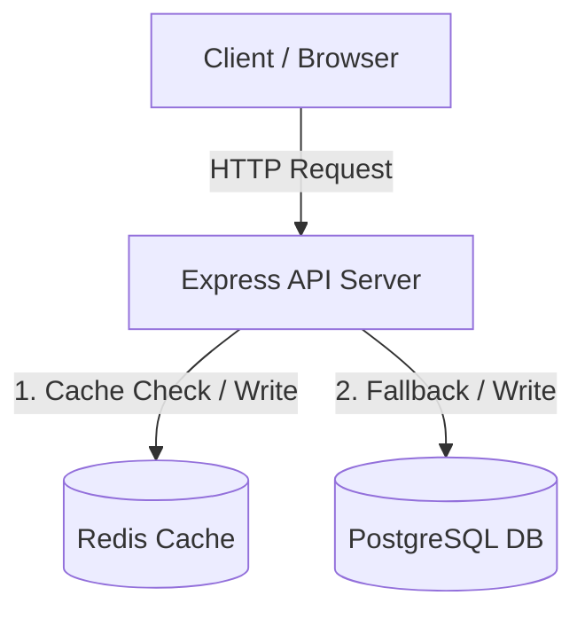
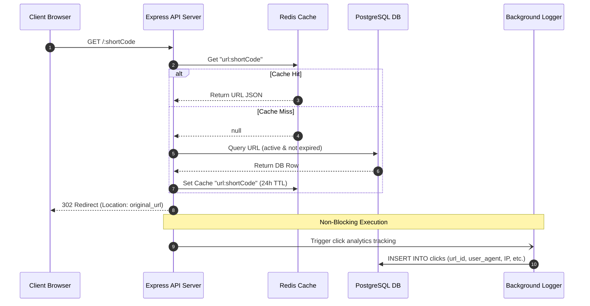

# System Design & Codebase Walkthrough: URL Shortener Backend

This document provides an in-depth breakdown of the URL Shortener backend. It explains the core technologies (Express, Docker, Redis, and PostgreSQL), how they integrate, key software engineering design patterns used in the codebase, and how to discuss these topics in system design and coding interviews.

---

## 1. High-Level Architecture & Data Flow

The application follows a standard **Tiered Architecture** where an Express.js API gateway coordinates requests between an in-memory caching layer (Redis) and a persistent SQL database (PostgreSQL).

### Architecture Diagram


### Request Flow: Redirection (`GET /:shortCode`)
The redirect endpoint is the most critical path in any URL shortener. To handle high traffic, it must return a response in **under 10 milliseconds**.



---

## 2. Docker & Containerization

Containerization ensures the application runs identically in development, staging, and production environments by packaging the operating system, libraries, and code together.

### The Multi-Stage Build (`Dockerfile`)
The [Dockerfile](file:///Users/akshatmahajan/url-shortener-backend/Dockerfile) uses a **multi-stage build** to optimize the production image size and security.
* **Stage 1 (`builder`)**: Uses `node:18-alpine` as a base, copies package files, and runs `npm ci` (clean install) to build the `node_modules` directory. Alpine Linux is chosen because it is minimal (around 5MB in size), reducing security attack surfaces and deployment sizes.
* **Stage 2 (Runtime)**: Starts from a clean `node:18-alpine` image. It copies **only** the production dependencies (`node_modules`) and the `src` folder from the builder stage, completely leaving behind dev tools and npm caches.

#### Critical Concept: `dumb-init` (PID 1 Problem)
> [!NOTE]
> In Linux, Process ID (PID) 1 is the init process, responsible for forwarding signals (like `SIGTERM` to stop the container) to child processes.
> Node.js was not designed to run as PID 1, meaning it does not handle OS signals properly by default. This causes containers to hang for 10 seconds before being forcefully killed (`SIGKILL`) during deployments.
> The Dockerfile resolves this by installing and using `dumb-init` as the `ENTRYPOINT`. It runs as PID 1 and forwards signals properly, enabling clean and instant graceful shutdowns.

### Container Orchestration (`docker-compose.yml`)
The [docker-compose.yml](file:///Users/akshatmahajan/url-shortener-backend/docker-compose.yml) file orchestrates three services:
1. **`postgres`**: Runs PostgreSQL 15. The database data is persisted using a Docker volume (`postgres_data`) mapping to `/var/lib/postgresql/data` so data is not lost when containers are restarted.
2. **`redis`**: Runs Redis 7 on port 6379, persisting to the `redis_data` volume.
3. **`api`**: Builds your local Express server. It uses a volume mount `./src:/app/src` mapping local source code into the container. This allows the application to hot-reload (`nodemon`) in development without rebuilding the Docker container.
4. **Healthchecks**: Both `postgres` and `redis` have health checks defined (`pg_isready` and `redis-cli ping`). The `api` container uses `depends_on` with `condition: service_healthy` to ensure it only starts up *after* the databases are fully online.

---

## 3. The Database Schema (PostgreSQL)

The database schema is defined in [001_init.sql](file:///Users/akshatmahajan/url-shortener-backend/src/migrations/001_init.sql). It balances relational constraints with performance optimizations.

### Key Database Tables

| Table | Primary Key | Key Columns | Purpose / Optimization |
| :--- | :--- | :--- | :--- |
| **`users`** | `UUID` (Auto-generated) | `email`, `password_hash`, `tier`, `api_key` | Supports user registration, API access tokens, and tiers. |
| **`urls`** | `UUID` (Auto-generated) | `short_code`, `original_url`, `custom_alias`, `expires_at`, `is_active` | Stores URL mappings. Supports expiration and soft deletion (`is_active`). |
| **`clicks`** | `BIGINT` (Auto-increment) | `url_id`, `ip_address`, `user_agent`, `country_code`, `device_type` | Analytical tracking table. Uses `BIGINT` for key scaling. |
| **`url_counter`**| `SERIAL` | `last_counter` | A single-row table used for generating atomic, collision-free short codes. |

### Advanced SQL & Interview Concepts in this Schema

#### 1. Column Optimization: `INET` Type
The `clicks` table stores `ip_address` using the `INET` data type rather than a standard `VARCHAR`. 
* **Why?** `INET` validates IPv4/IPv6 addresses natively and stores them in binary formats (4 bytes for IPv4, 16 bytes for IPv6) rather than strings (up to 45 bytes). This saves substantial storage space and speeds up indexes on high-write analytical tables.

#### 2. Indexing Strategy
Indexes speed up read operations at the cost of slight write overhead. The schema implements:
* **Unique Index on `short_code`**: Speeds up direct lookups on redirect.
* **Compound Index on `(user_id, created_at DESC)`**: Crucial for displaying a user's dashboard. A compound index allows retrieving a specific user's links sorted by the newest without requiring a slow filesystem sort (`filesort`).
* **Partial Indexes**:
  ```sql
  CREATE INDEX IF NOT EXISTS idx_urls_custom_alias ON urls(custom_alias) WHERE custom_alias IS NOT NULL;
  CREATE INDEX IF NOT EXISTS idx_urls_active ON urls(is_active) WHERE is_active = TRUE;
  ```
  * **Why?** By using a `WHERE` clause, the database only builds indexes for active links and custom aliases. Null values and deleted links are ignored. This drastically reduces index size and keeps them cached in RAM, improving memory efficiency.

#### 3. Atomic Sequential Short Code Generation (The SQL Counter Function)
To generate short codes, a centralized counter table and stored function are created:
```sql
CREATE OR REPLACE FUNCTION get_next_short_code_counter()
RETURNS BIGINT AS $$
BEGIN
  UPDATE url_counter SET last_counter = last_counter + 1, updated_at = NOW() WHERE id = 1;
  RETURN (SELECT last_counter FROM url_counter WHERE id = 1);
END;
$$ LANGUAGE plpgsql;
```
* **Why?** Generating a random short code and checking if it exists in the database can cause **collisions** as the database grows, requiring multiple database round-trips.
* **How it works**: By incrementing a single row in the database, PostgreSQL uses row-level locks to ensure only one transaction can increment the counter at a time. The resulting number is converted to a string using **Base62 encoding** (explained below), producing a guaranteed unique, collision-free code without loop retries.

---

## 4. The Encoding Utility (Base62)

The file [encoding.js](file:///Users/akshatmahajan/url-shortener-backend/src/utils/encoding.js) contains the math behind URL shortening.

### What is Base62?
Computers default to binary (base-2). Decimal is base-10. Hexadecimal is base-16.
Base62 uses 62 alphanumeric characters:
`0-9` (10 chars) + `a-z` (26 chars) + `A-Z` (26 chars) = `62` characters.

```javascript
const ALPHABET = '0123456789abcdefghijklmnopqrstuvwxyzABCDEFGHIJKLMNOPQRSTUVWXYZ';
const BASE = ALPHABET.length; // 62
```

### Encoding and Decoding Algorithm
* **Encoding**: Takes a database-generated bigint (e.g., `1001503`) and divides it by 62 repeatedly, mapping the remainder to characters in the `ALPHABET` until the quotient is `0`.
* **Decoding**: Reverses the process, converting characters back to base-10 using their index positions.

For example, a counter value of `1,000,005` (with offset applied) encodes to `4e9` in Base62.
* A 6-character Base62 string can represent up to $62^6 = 56.8 \text{ Billion}$ unique URLs.
* A 7-character Base62 string can represent up to $62^7 = 3.5 \text{ Trillion}$ unique URLs.

---

## 5. Caching Strategy with Redis

In [urlModel.js](file:///Users/akshatmahajan/url-shortener-backend/src/models/urlModel.js), a **Cache-Aside (Lazy Loading)** design pattern is implemented.

```javascript
// Check cache first
const cached = await cache.get(`url:${shortCode}`);
if (cached) {
  return JSON.parse(cached); // Cache Hit
}

// Query database on Cache Miss
const result = await db.query(query, [shortCode]);
const url = result.rows[0];

// Cache for future requests (24 hour TTL)
await cache.set(`url:${shortCode}`, JSON.stringify(url), 86400);
```

### Core Caching Principles
1. **Cache Hit**: Returns data from Redis in-memory storage (takes 1-3 ms), avoiding the slower disk-based PostgreSQL lookup.
2. **Cache Miss**: Reads from PostgreSQL, writes the result to Redis with a Time-To-Live (TTL) of 24 hours (`86400` seconds), and returns the object.
3. **Write-Through / Eviction (Invalidation)**: When a link is soft-deleted, the code invokes:
   ```javascript
   await cache.del(`url:${shortCode}`);
   ```
   This ensures that subsequent requests do not fetch stale, deleted redirect mappings from the cache.

---

## 6. High-Performance Redirect Mechanics

To build systems at scale, API developers use **Non-Blocking I/O** for heavy tasks that aren't critical to the immediate HTTP response.

In [redirectRoutes.js](file:///Users/akshatmahajan/url-shortener-backend/src/routes/redirectRoutes.js):
```javascript
// 1. Get original URL
const urlRecord = await URLModel.getByShortCode(shortCode);

// 2. Queue click event asynchronously (DO NOT AWAIT!)
queueClickEvent(urlRecord, req).catch((err) => {
  logger.warn('Failed to queue click event', { error: err.message });
});

// 3. Perform redirect immediately
res.redirect(302, urlRecord.original_url);
```

### Why is this optimized?
Recording a click requires parsing the HTTP headers (via `ua-parser-js` to get the OS and device) and executing an `INSERT` statement into PostgreSQL. If we used `await queueClickEvent(...)`, the user would have to wait for the database write to complete before their browser redirected.
By starting the promise and **not** awaiting it, Node.js handles the file and database operations in its background threads (via Libuv), allowing Express to send the HTTP `302 Found` header immediately.

#### System Design Interview Tip
> [!TIP]
> In an enterprise-scale architecture (like Bitly), inserting directly to a SQL database on every redirect would crash the database under high traffic load.
> In interviews, explain that instead of writing directly to PostgreSQL, you would send the click event to a message queue like **Apache Kafka** or **RabbitMQ**, or push it onto a **Redis Stream/List**. Background workers (written in Go, Node, or Python) would pull events from the queue in batches and bulk-insert them into an analytics database like ClickHouse or Elasticsearch.

---

## 7. Operational Best Practices in Node/Express

The codebase implements several production-grade practices that are critical for stability and scaling:

### 1. Request ID Tracing
In [middleware/index.js](file:///Users/akshatmahajan/url-shortener-backend/src/middleware/index.js), a custom `requestId` middleware generates a unique UUID for every incoming request:
```javascript
req.id = req.get('x-request-id') || crypto.randomUUID();
res.set('X-Request-Id', req.id);
```
Every log message includes this `requestId`. If a request throws an error, we can search the logs for that specific UUID to view the complete request flow, making troubleshooting simple.

### 2. JSON Structured Logging
The logger ([logger.js](file:///Users/akshatmahajan/url-shortener-backend/src/utils/logger.js)) outputs log entries in structured JSON format if `LOG_FORMAT=json` is set:
```javascript
{"timestamp":"2026-07-15T13:31:17Z","level":"info","message":"URL shortened","userId":"123","shortCode":"4e9"}
```
Standard console logs are strings, which are hard for computer programs to parse. In production, logs are forwarded to platforms like ELK (Elasticsearch/Logstash/Kibana) or Datadog. Structured JSON logs make it easy to query, filter, and alert based on attributes like latency, user, or status.

### 3. Graceful Shutdown
In [server.js](file:///Users/akshatmahajan/url-shortener-backend/src/server.js), when a termination signal is received (`SIGTERM` or `SIGINT`):
1. The HTTP server stops accepting new connections via `server.close()`.
2. Existing requests are allowed to finish processing (up to a 10s timeout).
3. Database pools and Redis connections are closed cleanly.
4. The process exits with code `0`.
This prevents user request dropouts and database connection corruption during scaling events or server restarts.

---

## 8. 💡 Interview Tips & Code Auditing

When discussing this project in technical interviews, you can demonstrate exceptional code-auditing skills by highlighting architectural features and calling out minor improvement areas:

### Route Precedence Gotcha in Express
A common bug in Express route definitions occurs in [analyticsRoutes.js](file:///Users/akshatmahajan/url-shortener-backend/src/routes/analyticsRoutes.js):
```javascript
// Express matches routes top-to-bottom
router.get('/:shortCode', async (req, res) => { ... });
router.get('/top/urls', async (req, res) => { ... });
```
* **The Bug**: Since `/:shortCode` is a dynamic route parameter defined first, requesting `/api/v1/analytics/top/urls` will cause Express to treat `"top"` as the `:shortCode` parameter and fail with a 404 because "top" doesn't exist in the database!
* **The Fix**: Dynamic wildcard routes (like `/:shortCode` or `/:id`) should always be declared **after** static endpoints (like `/top/urls`) in the route definitions.

### SQL Database Connection Leaks
In [urlModel.js](file:///Users/akshatmahajan/url-shortener-backend/src/models/urlModel.js), the batch creation uses a transaction:
```javascript
const client = await db.getClient();
try {
  await client.query('BEGIN');
  // ... loop queries
  await client.query('COMMIT');
} catch (error) {
  await client.query('ROLLBACK');
  throw error;
} finally {
  client.release(); // Crucial!
}
```
* **Why it matters**: Calling `client.release()` inside the `finally` block is essential. Without it, if a rollback occurred, that database connection would remain open and locked out of the pool forever. Eventually, the app would exhaust all connections (max pool size) and freeze.

### CORS Security
CORS (Cross-Origin Resource Sharing) middleware in [middleware/index.js](file:///Users/akshatmahajan/url-shortener-backend/src/middleware/index.js) checks incoming requests against a whitelist:
```javascript
origin: (process.env.CORS_ORIGIN || 'http://localhost:3000').split(',')
```
Avoid using `*` (allow all) in production. Splitting a list of environment domains secures the application from CSRF attacks while allowing your specific frontend (e.g., on port 3000 or 3001) to securely interact with the backend API.
